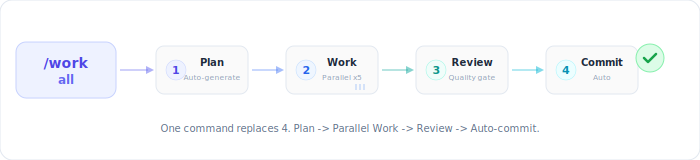
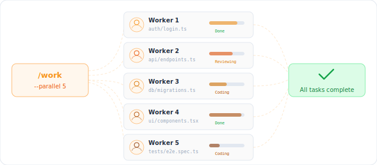
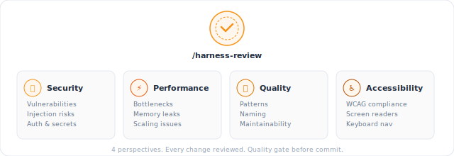

<p align="center">
  
</p>

<p align="center">
  <strong>规划. 执行. 审查. 发布.</strong><br>
  <em>将 Claude Code 转变为自律的开发伙伴。</em>
</p>

<p align="center">
  <a href="https://github.com/jyf2100/claude-code-harness/releases/latest"></a>
  <a href="LICENSE.md"></a>
  <a href="docs/CLAUDE_CODE_COMPATIBILITY.md"></a>
  
  
</p>

<p align="center">
  <a href="README.md">English</a> | <a href="README_ja.md">日本語</a> | 中文
</p>

---

## 为什么选择 Harness？

Claude Code 功能强大。Harness 将这种原始能力转化为更值得信赖、更难脱轨的交付循环。

<p align="center">
  
</p>

5 动词技能将设置、规划、执行、审查和发布保持在同一条路径上。TypeScript 守护引擎保护执行过程，验证可以在需要证明时重新运行。

---

## 环境要求

- **Claude Code v2.1+** ([安装指南](https://docs.anthropic.com/claude-code))
- **Node.js 18+** (用于 TypeScript 核心引擎和安全钩子)

---

## 30 秒安装

```bash
# 在项目中启动 Claude Code
claude

# 添加市场并安装
/plugin marketplace add jyf2100/claude-code-harness
/plugin install claude-code-harness@claude-code-harness-marketplace

# 初始化你的项目
/harness-setup
```

完成。从 `/harness-plan` 开始。

---

## 🪄 快速开始：一键执行

**不想看这么多？** 直接输入：

```
/harness-work all
```

**一个命令在计划批准后运行完整循环。** 规划 → 并行实现 → 审查 → 提交。

<p align="center">
  
</p>

> ⚠️ **实验性工作流**：一旦批准计划，Claude 将运行至完成。在生产环境依赖之前，请在 [docs/evidence/work-all.md](docs/evidence/work-all.md) 验证成功/失败契约。

---

## 5 动词工作流

<p align="center">
  
</p>

### 0. 设置

```bash
/harness-setup
```

引导生成项目文件、规则和命令界面，确保后续循环在相同约定下运行。

### 1. 规划

```bash
/harness-plan
```

> "我想要一个带邮箱验证的登录表单"

Harness 创建带有明确验收标准的 `Plans.md`。

### 2. 执行

```bash
/harness-work              # 自动检测并行度
/harness-work --parallel 5 # 5 个 worker 同时执行
```

每个 worker 实现、自检并报告。

<p align="center">
  
</p>

### 3. 审查

```bash
/harness-review
```

<p align="center">
  
</p>

| 视角 | 关注点 |
|------|--------|
| 安全 | 漏洞、注入、认证 |
| 性能 | 瓶颈、内存、扩展 |
| 质量 | 模式、命名、可维护性 |
| 可访问性 | WCAG 合规、屏幕阅读器 |

### 4. 发布

```bash
/harness-release
```

在实现和审查完成后，将验证结果打包为 CHANGELOG、标签和发布交接步骤。

---

## 安全优先

<p align="center">
  
</p>

Harness v3 通过 **TypeScript 守护引擎** (`core/`) 保护你的代码库 —— 13 条声明式规则 (R01–R13)，编译并通过类型检查：

| 规则 | 保护对象 | 动作 |
|------|----------|------|
| R01 | `sudo` 命令 | **拒绝** |
| R02 | `.git/`、`.env`、密钥 | **拒绝**写入 |
| R03 | Shell 写入保护文件 | **拒绝** |
| R04 | 项目外写入 | **询问** |
| R05 | `rm -rf` | **询问** |
| R06 | `git push --force` | **拒绝** |
| R07–R09 | 模式特定和密钥读取守护 | 上下文感知 |
| R10 | `--no-verify`、`--no-gpg-sign` | **拒绝** |
| R11 | `git reset --hard main/master` | **拒绝** |
| R12 | 直接推送 `main` / `master` | **警告** |
| R13 | 保护文件编辑 | **警告** |
| Post | `it.skip`、断言篡改 | **警告** |
| Perm | `git status`、`npm test` | **自动允许** |

---

## 5 动词技能，零配置

v3 将 42 个技能统一为 **5 动词技能**。先从动词开始，然后在需要时添加 Breezing、Codex 或 2-agent 流程。

<table>
<tr>
<td align="center" width="20%"><h3>/plan</h3>想法 → Plans.md</td>
<td align="center" width="20%"><h3>/work</h3>并行实现</td>
<td align="center" width="20%"><h3>/review</h3>4 角度代码审查</td>
<td align="center" width="20%"><h3>/release</h3>标签 + GitHub Release</td>
<td align="center" width="20%"><h3>/setup</h3>项目初始化和配置</td>
</tr>
</table>

### 关键命令

| 命令 | 功能 | 旧版重定向 |
|------|------|-----------|
| `/harness-plan` | 想法 → `Plans.md` | `/plan-with-agent`、`/planning` |
| `/harness-work` | 并行实现 | `/work`、`/breezing`、`/impl` |
| `/harness-work all` | 批准的计划 → 实现 → 审查 → 提交 | `/work all` |
| `/harness-review` | 4 视角代码审查 | `/harness-review`、`/verify` |
| `/harness-release` | CHANGELOG、标签、GitHub Release | `/release-har`、`/handoff` |
| `/harness-setup` | 初始化项目 | `/harness-init`、`/setup` |
| `/memory` | 管理 SSOT 文件 | — |

---

## 适合谁？

| 你是 | Harness 帮你 |
|------|-------------|
| **开发者** | 内置 QA，更快交付 |
| **自由职业者** | 向客户交付审查报告 |
| **独立开发者** | 快速迭代不出错 |
| **VibeCoder** | 用自然语言构建应用 |
| **团队负责人** | 跨项目执行标准 |

---

## 架构

```
claude-code-harness/
├── core/           # TypeScript 守护引擎（严格 ESM，NodeNext）
│   └── src/        #   guardrails/ state/ engine/
├── skills-v3/      # 5 动词技能（plan/execute/review/release/setup）
├── agents-v3/      # 3 个代理（worker/reviewer/scaffolder）
├── hooks/          # 薄 shim → core/ 引擎
├── skills/         # 41 个旧技能（保留兼容性）
├── agents/         # 11 个旧代理（保留兼容性）
├── scripts/        # v2 钩子脚本（与 v3 core 共存）
└── templates/      # 生成模板
```

---

## 高级功能

<details>
<summary><strong>Breezing（代理团队）</strong></summary>

使用自主代理团队运行整个任务列表：

```bash
/harness-work breezing all                    # 计划审查 + 并行实现
/harness-work breezing --no-discuss all       # 跳过计划审查，直接编码
/harness-work breezing --codex all            # 委托给 Codex 引擎
```

**Phase 0（规划讨论）** 默认运行 —— Planner 分析任务质量，Critic 挑战计划，然后你在编码开始前批准。

</details>

<details>
<summary><strong>Codex CLI 设置</strong></summary>

将 Harness 与 [Codex CLI](https://github.com/openai/codex) 配合使用 —— 无需 Claude Code。

**前置条件**：[Codex CLI](https://github.com/openai/codex) (`npm i -g @openai/codex`)、OpenAI API 密钥 (`OPENAI_API_KEY`)、Git。

```bash
# 1. 克隆 Harness 仓库
git clone https://github.com/jyf2100/claude-code-harness.git
cd claude-code-harness

# 2. 安装技能/规则到用户目录（~/.codex）
./scripts/setup-codex.sh --user

# 3. 进入你的项目开始工作
cd /path/to/your-project
codex
```

在 Codex 中，使用 `$harness-plan`、`$harness-work`、`$breezing` 和 `$harness-review`。

</details>

---

## 故障排除

| 问题 | 解决方案 |
|------|----------|
| 命令未找到 | 先运行 `/harness-setup` |
| Windows 上 `harness-*` 命令丢失 | 更新或重新安装插件 |
| 插件未加载 | 清除缓存：`rm -rf ~/.claude/plugins/cache/claude-code-harness-marketplace/` 并重启 |
| 钩子不工作 | 确保安装了 Node.js 18+ |

需要更多帮助，[提交 Issue](https://github.com/jyf2100/claude-code-harness/issues)。

---

## 卸载

```bash
/plugin uninstall claude-code-harness
```

项目文件（Plans.md、SSOT 文件）保持不变。

---

## 贡献

欢迎提交 Issue 和 PR。参见 [CONTRIBUTING.md](CONTRIBUTING.md)。

---

## 许可证

**MIT 许可证** — 可自由使用、修改、商业化。

[English](LICENSE.md) | [日本語](LICENSE.ja.md)
