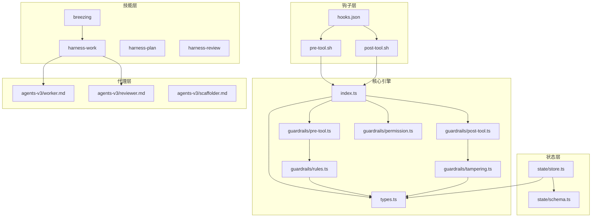

# Claude Code Harness - 仓库深度走读报告

**生成日期**: 2026-03-26
**仓库**: jyf2100/claude-code-harness
**版本**: v3.14.0
**主要语言**: TypeScript / Shell (Bash)

---

## 概要

Claude Code Harness 是一个**自指涉插件系统**，通过"计划 → 执行 → 审查"工作流实现 Claude Code 的自主运行。项目实现了复杂的护栏引擎、多代理编排和广泛的钩子系统，让 Claude 能够使用自身来改进自身。

**核心优势**:
- 完善的 TypeScript 护栏引擎，包含 13 条声明式安全规则
- 多代理团队编排（Lead/Worker/Reviewer 模式）
- 测试篡改检测，防止实现捷径
- 覆盖 20+ 生命周期事件的钩子系统

**架构哲学**: 自托管、自改进 —— Harness 使用自己的技能和代理来开发自己。

---

## 阶段 1: 架构地图

### 目录结构

```
claude-code-harness/
├── core/                    # TypeScript 核心引擎
│   └── src/
│       ├── index.ts         # stdin → 路由 → stdout 管道
│       ├── types.ts         # HookInput, HookResult, Signal 类型定义
│       ├── guardrails/      # 护栏引擎
│       │   ├── rules.ts     # 13 条声明式规则 (R01-R13)
│       │   ├── pre-tool.ts  # PreToolUse 评估
│       │   ├── post-tool.ts # PostToolUse 评估
│       │   ├── permission.ts# PermissionRequest 处理
│       │   └── tampering.ts # 测试篡改检测
│       ├── state/           # SQLite 状态管理
│       │   ├── store.ts     # HarnessStore 类
│       │   ├── schema.ts    # DDL 定义
│       │   └── migration.ts # 数据库迁移
│       └── engine/          # 生命周期管理
│           └── lifecycle.ts # 会话生命周期
│
├── skills/                  # 27 个技能定义
│   ├── harness-work/        # 统一执行（solo/parallel/breezing）
│   ├── breezing/            # 团队执行别名
│   ├── harness-plan/        # 规划技能
│   ├── harness-review/      # 代码审查
│   ├── harness-release/     # 发布管理
│   └── ...                  # 22 个其他技能
│
├── agents-v3/               # 3 代理系统 (v3)
│   ├── worker.md            # 实现代理
│   ├── reviewer.md          # 审查代理（只读）
│   ├── scaffolder.md        # 状态管理代理
│   └── team-composition.md  # 团队编排指南
│
├── hooks/                   # 钩子入口点
│   ├── hooks.json           # 钩子配置
│   ├── pre-tool.sh          # PreToolUse 垫片
│   └── post-tool.sh         # PostToolUse 垫片
│
├── scripts/                 # 70+ Shell 脚本
│   ├── run-script.js        # 钩子脚本运行器
│   ├── session-*.sh         # 会话管理
│   ├── codex-*.sh           # Codex CLI 集成
│   └── ...                  # 工具脚本
│
├── .claude-plugin/          # 插件清单
│   ├── plugin.json          # 插件元数据
│   └── settings.json        # 默认设置
│
└── .claude/
    ├── rules/               # 开发规则
    ├── memory/              # SSOT 记忆文件
    └── agent-memory/        # 代理专属记忆
```

### 模块依赖图



### 入口点

| 入口点 | 类型 | 用途 |
|--------|------|------|
| `core/src/index.ts` | CLI | stdin JSON → 路由 → stdout JSON |
| `hooks/pre-tool.sh` | Hook | PreToolUse → 护栏检查 |
| `hooks/post-tool.sh` | Hook | PostToolUse → 篡改检测 |
| `skills/*/SKILL.md` | Skill | 用户斜杠命令 |
| `agents-v3/*.md` | Agent | 子代理定义 |

---

## 阶段 2: 关键路径分析

### 钩子执行管道

```
Claude Code
    │
    ▼
┌─────────────────────────────────────────────────────────┐
│ 钩子事件 (PreToolUse / PostToolUse / 等)                │
│ 输入: {"tool_name": "Write", "tool_input": {...}}       │
└─────────────────────────────────────────────────────────┘
    │
    ▼
┌─────────────────────────────────────────────────────────┐
│ hooks/hooks.json                                        │
│ 匹配器: "Write|Edit|MultiEdit|Bash|Read"                │
│ → 路由到 pre-tool.sh                                    │
└─────────────────────────────────────────────────────────┘
    │
    ▼
┌─────────────────────────────────────────────────────────┐
│ hooks/pre-tool.sh                                       │
│ 解析 JSON → 调用 core/src/index.ts                      │
└─────────────────────────────────────────────────────────┘
    │
    ▼
┌─────────────────────────────────────────────────────────┐
│ core/src/index.ts                                       │
│ 1. readStdin() → 解析 JSON                              │
│ 2. route("pre-tool", input)                             │
│ 3. evaluatePreTool() → 规则评估                         │
│ 4. stdout JSON 结果                                     │
└─────────────────────────────────────────────────────────┘
    │
    ▼
┌─────────────────────────────────────────────────────────┐
│ core/src/guardrails/rules.ts                            │
│ for each rule in GUARD_RULES:                           │
│   if rule.toolPattern 匹配 tool_name:                   │
│     result = rule.evaluate(context)                     │
│     if result !== null: return result                   │
│ return {decision: "approve"}                            │
└─────────────────────────────────────────────────────────┘
    │
    ▼
┌─────────────────────────────────────────────────────────┐
│ HookResult 输出                                         │
│ {"decision": "approve|deny|ask", "reason": "..."}       │
└─────────────────────────────────────────────────────────┘
    │
    ▼
Claude Code (继续 / 阻止 / 询问用户)
```

### Breezing 团队执行流程

```
用户: /breezing all
    │
    ▼
┌─────────────────────────────────────────────────────────┐
│ Lead 代理（当前 Claude 会话）                           │
│ Phase A: 预委托                                         │
│ 1. 读取 Plans.md                                        │
│ 2. 解析依赖图                                           │
│ 3. 评估任务复杂度以决定 effort 注入                     │
└─────────────────────────────────────────────────────────┘
    │
    ▼
┌─────────────────────────────────────────────────────────┐
│ Phase B: 委托（按依赖顺序逐个任务执行）                 │
│                                                         │
│ B-1: 生成 Worker                                        │
│   Agent(subagent_type="worker", isolation="worktree")   │
│   → Worker 在 worktree 中创建 commit                    │
│                                                         │
│ B-2: Lead 审查（Codex exec 或 Reviewer 代理）           │
│   → verdict: APPROVE / REQUEST_CHANGES                  │
│                                                         │
│ B-3: 修复循环（最多 3 轮）                              │
│   if REQUEST_CHANGES:                                   │
│     SendMessage(to=worker, "修复这些问题")              │
│     Worker amend commit                                 │
│     重新审查                                            │
│                                                         │
│ B-4: Cherry-pick 到 main                                │
│   if APPROVE: git cherry-pick {commit}                  │
│   更新 Plans.md: cc:WIP → cc:完毕 [hash]                │
└─────────────────────────────────────────────────────────┘
    │
    ▼
┌─────────────────────────────────────────────────────────┐
│ Phase C: 后委托                                         │
│ 1. 汇总所有 commits                                     │
│ 2. 生成丰富的完成报告                                   │
│ 3. 最终 Plans.md 验证                                   │
└─────────────────────────────────────────────────────────┘
```

---

## 阶段 3: 核心子系统深挖

### 3.1 护栏引擎

**位置**: `core/src/guardrails/`

护栏引擎是一个**声明式规则评估系统**，在工具调用执行前后进行检查。

#### 13 条护卫规则 (R01-R13)

| 规则 ID | 工具 | 模式 | 决策 |
|---------|------|------|------|
| R01 | Bash | `sudo` 命令 | **拒绝** |
| R02 | Write/Edit | 受保护路径（.env, .git, *.pem） | **拒绝** |
| R03 | Bash | 通过 shell 写入受保护路径 | **拒绝** |
| R04 | Write/Edit | 项目根目录外 | **询问** |
| R05 | Bash | `rm -rf` 模式 | **询问** |
| R06 | Bash | `git push --force` | **拒绝** |
| R07 | Write/Edit | Codex 模式激活时 | **拒绝** |
| R08 | Write/Edit/Bash | Breezing reviewer 角色 | **拒绝** |
| R09 | Read | 读取机密文件 | **通过 + 警告** |
| R10 | Bash | `--no-verify` / `--no-gpg-sign` | **拒绝** |
| R11 | Bash | 在 main/master 上 `git reset --hard` | **拒绝** |
| R12 | Bash | 直接推送到 main/master | **通过 + 警告** |
| R13 | Write/Edit | 受保护的审查路径（package.json, Dockerfile） | **通过 + 警告** |

#### 规则评估代码模式

```typescript
// core/src/guardrails/rules.ts
export const GUARD_RULES: readonly GuardRule[] = [
  {
    id: "R01:no-sudo",
    toolPattern: /^Bash$/,
    evaluate(ctx: RuleContext): HookResult | null {
      const command = ctx.input.tool_input["command"];
      if (typeof command !== "string") return null;
      if (!hasSudo(command)) return null;
      return {
        decision: "deny",
        reason: "sudo 的使用被禁止..."
      };
    },
  },
  // ... 另外 12 条规则
];

export function evaluateRules(ctx: RuleContext): HookResult {
  for (const rule of GUARD_RULES) {
    if (!rule.toolPattern.test(toolName)) continue;
    const result = rule.evaluate(ctx);
    if (result !== null) return result;
  }
  return { decision: "approve" };
}
```

### 3.2 测试篡改检测

**位置**: `core/src/guardrails/tampering.ts`

检测破坏测试完整性的模式：

| 模式 ID | 检测内容 |
|---------|----------|
| T01 | `it.skip` / `describe.skip` |
| T02 | `xit` / `xdescribe` |
| T03 | `@pytest.mark.skip` |
| T04 | `t.Skip()` |
| T05 | 注释掉的 `expect()` |
| T06 | 注释掉的 `assert()` |
| T07 | TODO 替换断言 |
| T08 | `eslint-disable` |
| T09 | CI 中的 `continue-on-error: true` |
| T10 | CI 中的 `if: always()` |
| T11 | 硬编码的 `answers_for_tests` 字典 |
| T12 | 直接返回测试值 |

### 3.3 状态管理 (SQLite)

**位置**: `core/src/state/store.ts`

使用 `better-sqlite3` 实现同步、WAL 模式持久化。

#### 数据库 Schema

```sql
-- 会话表
CREATE TABLE sessions (
  session_id TEXT PRIMARY KEY,
  mode TEXT NOT NULL,           -- normal/work/codex/breezing
  project_root TEXT NOT NULL,
  started_at INTEGER NOT NULL,
  ended_at INTEGER,
  context_json TEXT
);

-- 代理间信号表
CREATE TABLE signals (
  id INTEGER PRIMARY KEY,
  type TEXT NOT NULL,           -- task_completed, teammate_idle 等
  from_session_id TEXT NOT NULL,
  to_session_id TEXT,
  payload_json TEXT NOT NULL,
  sent_at INTEGER NOT NULL,
  consumed INTEGER DEFAULT 0
);

-- 任务失败追踪表
CREATE TABLE task_failures (
  id INTEGER PRIMARY KEY,
  task_id TEXT NOT NULL,
  session_id TEXT NOT NULL,
  severity TEXT NOT NULL,       -- warning/error/critical
  message TEXT NOT NULL,
  detail TEXT,
  failed_at INTEGER NOT NULL,
  attempt INTEGER NOT NULL
);

-- 工作模式状态表（TTL 24小时）
CREATE TABLE work_states (
  session_id TEXT PRIMARY KEY,
  codex_mode INTEGER DEFAULT 0,
  bypass_rm_rf INTEGER DEFAULT 0,
  bypass_git_push INTEGER DEFAULT 0,
  expires_at INTEGER NOT NULL
);
```

### 3.4 钩子系统

**位置**: `hooks/hooks.json`

20+ 钩子事件，支持 command/agent/prompt 类型：

| 事件 | 用途 | 钩子类型 |
|------|------|----------|
| `PreToolUse` | 执行守护 | command, agent |
| `PostToolUse` | 篡改检测、清理 | command, agent |
| `SessionStart` | 环境设置 | command |
| `SessionEnd` | 清理、摘要 | command |
| `SubagentStart/Stop` | 代理生命周期追踪 | command |
| `TeammateIdle` | 团队协调 | command |
| `TaskCompleted` | 进度追踪 | command |
| `PreCompact` | WIP 任务警告 | command, agent |
| `PostCompact` | 上下文重新注入 | command |
| `Elicitation` | MCP 表单处理 | command |
| `UserPromptSubmit` | 策略注入、命令追踪 | command |
| `PermissionRequest` | 权限路由 | command |
| `Stop` | 会话摘要、WIP 检查 | command, agent |
| `StopFailure` | API 错误日志 | command |

---

## 阶段 4: 快速上手

### 前置条件

- Node.js 18+
- Claude Code CLI（推荐 v2.1.69+）
- Git

### 安装

```bash
# 从 GitHub fork 安装
claude plugin add https://github.com/jyf2100/claude-code-harness

# 或手动安装
git clone https://github.com/jyf2100/claude-code-harness.git
claude plugin add ./claude-code-harness
```

### 核心技能使用

```bash
# 规划任务
/harness-plan create

# 执行下一个任务（solo 模式）
/harness-work

# 使用团队执行所有任务
/breezing all

# 代码审查
/harness-review

# 发布新版本
/harness-release
```

### 关键配置文件

| 文件 | 用途 |
|------|------|
| `.claude-plugin/plugin.json` | 插件元数据 |
| `.claude-plugin/settings.json` | 默认权限 |
| `hooks/hooks.json` | 钩子配置 |
| `Plans.md` | 任务待办（v2 格式） |

---

## 阶段 5: 文档总结

### 内部文档

| 文档 | 用途 |
|------|------|
| `CLAUDE.md` | 项目开发指南（中文） |
| `docs/CLAUDE-feature-table.md` | Claude Code 功能兼容性 |
| `docs/CLAUDE-commands.md` | 命令参考 |
| `docs/CLAUDE-skill-catalog.md` | 技能层次结构 |
| `.claude/rules/hooks-editing.md` | 钩子编辑规则 |
| `.claude/rules/skill-editing.md` | 技能编辑规则 |
| `.claude/rules/versioning.md` | SemVer 指南 |
| `.claude/rules/v3-architecture.md` | v3 架构详情 |

### 代理记忆系统

- 位置: `.claude/agent-memory/{agent-name}/`
- 跨会话持久化的学习内容
- 模式、失败记录、项目特定知识

---

## 阶段 6: 评分卡

### 评分维度（满分 100 分）

| 维度 | 分数 | 依据 |
|------|------|------|
| **架构设计** | 9/10 | 清晰的四层分离：核心引擎 / 技能 / 代理 / 钩子。声明式规则，状态隔离 |
| **代码质量** | 8/10 | TypeScript 严格模式，完善的类型定义。部分 shell 脚本可迁移到 TS |
| **安全性** | 9/10 | 13 条护卫规则，测试篡改检测，受保护路径阻止，无密钥处理 |
| **可测试性** | 7/10 | 核心引擎有单元测试。钩子的集成测试可扩展 |
| **文档** | 9/10 | 完善的中文文档，内联注释，技能文档 |
| **可扩展性** | 9/10 | 插件架构，声明式规则，27 个技能，3 个代理，20+ 钩子 |
| **可观测性** | 8/10 | 会话追踪，信号系统，任务失败日志。可添加指标导出 |
| **自托管** | 10/10 | 使用自身开发自身 —— 终极的吃自己的狗粮 |

**总分**: **88/100**

### 改进建议 Top 5

| 优先级 | 建议 | 影响 |
|--------|------|------|
| 1 | **扩展 shell 脚本的测试覆盖** | 高 - 可靠性 |
| 2 | **添加 OTel 指标导出** 用于生产监控 | 中 - 可观测性 |
| 3 | **将关键 shell 脚本迁移到 TypeScript** | 中 - 可维护性 |
| 4 | **为钩子管道添加集成测试** | 高 - 可靠性 |
| 5 | **创建贡献指南** (CONTRIBUTING.md) | 低 - 社区 |

---

## 扩展点

### 添加新的护卫规则

1. 编辑 `core/src/guardrails/rules.ts`
2. 在 `GUARD_RULES` 数组中添加新的 `GuardRule` 条目
3. 实现 `evaluate()` 函数
4. 运行 `./scripts/sync-plugin-cache.sh`

### 添加新技能

1. 创建 `skills/{skill-name}/SKILL.md`
2. 添加 YAML frontmatter，包含 `name`、`description`、`allowed-tools`
3. 可选添加 `references/` 目录存放详细文档
4. 更新 CHANGELOG.md

### 添加新钩子

1. 编辑 `hooks/hooks.json`（以及 `.claude-plugin/hooks.json`）
2. 在相应的事件类型下添加条目
3. 运行 `./scripts/sync-plugin-cache.sh`

---

## 结论

Claude Code Harness 是一个复杂的、自改进的插件系统，展示了以下高级模式：
- **声明式安全** 通过护栏规则实现
- **多代理编排** 采用 Lead/Worker/Reviewer 模式
- **基于钩子的可扩展性** 覆盖 20+ 生命周期事件
- **自指涉开发** —— 使用自身来构建自身

该项目非常适合希望用适当的护栏和质量门控自动化 Claude Code 工作流的团队。

---

*由 Claude Code 使用 repo-deep-dive-report 技能生成*
